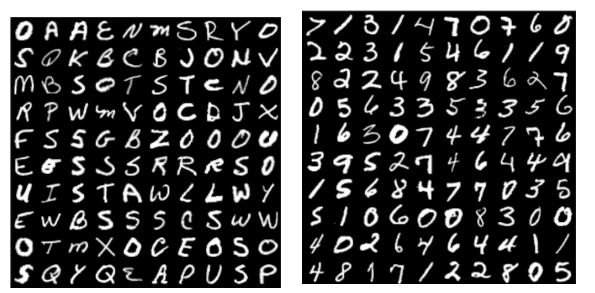
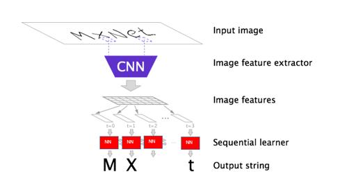
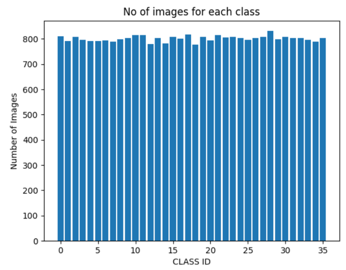

# Optical Character Recognition
A project that recognizes characters (i.e., Alphabets and Numbers) on paper using Convolutional Neural Network. So, to predict characters, around 36,000 images are used and out of those 80% is used for training and 20% for testing which is common in every 80:20 rule. I have used the dataset or images from [Kaggle Dataset](https://www.kaggle.com/datasets/sachinpatel21/az-handwritten-alphabets-in-csv-format) for Alphabets and Keras sample dataset for Numbers.

## Convolutional Neural Network (CNN)
Convolutional Neural Network is a class of deep neural algorithms often used to analyse visual imagery. A convolutional neural network (CNN) receives an image, extracts features using filters, and mainly for image processing, classification, and segmentation.

## Dataset
Each Image is analysed through its pixel value (in our case each image size is 32×32 pixels), and each character has 1000 images. This is the distribution images of training model.

## Prediction
During the training process, the image needs to undergo lot of filters that includes improving image quality, converting the image to grayscale for better improvement, adding blurness to the image for to recognize the area of the image. This is sample image of using trained data to predict images.

## References
[\[1\]](https://arxiv.org/abs/1707.08831) STN-OCR: A single Neural Network for Text Detection and Text Recognition by Christian Bartz Haojin Yang Christoph Meinel Hasso Plattner Institute, University of Potsdam Prof.-Dr.-Helmert Strabe 2-3 14482 Potsdam, Germany -2017
